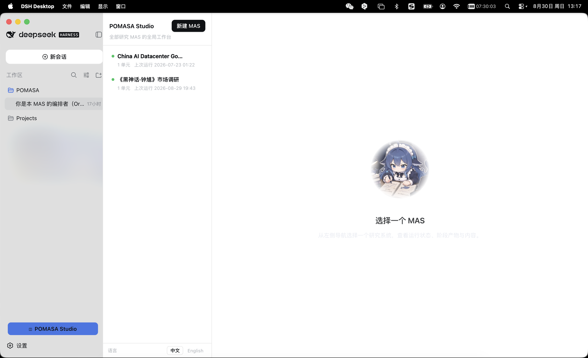

# POMASA Studio

[ [English](./README.md) | 中文 ]

POMASA Studio 是 [DeepSeek Harness](https://github.com/deepseek-ai/deepseek-harness)（dsh）的一个插件，把 POMASA 研究工作台带进 dsh。它管理本机 `~/.pomasa` 下的所有 POMASA 研究多代理系统（MAS）：列出已有系统、从需求新建、跟随运行状态、查看各阶段产物。



## 功能特性

- 列出 `~/.pomasa` 下的全部 MAS，展示运行状态与上次运行时间。
- 用表单描述研究需求，让 POMASA 生成器按模式目录产出一个自包含的多代理系统。
- 支持单次整体运行与按研究对象多次隔离运行两种方式，运行会话在 dsh 侧栏可见。
- 查看每个阶段声明的产物契约与实际产物，Markdown 可直接下载。
- 运行过的单元可以全部重跑，也可以保留现有成果、按你的指令继续完善；破坏性重跑会要求二次确认。
- 多单元 MAS 可以随手新增单元，单元列表可折叠成"当前单元 + 运行统计"的摘要行。
- 新建工作区自带 MCP 配置模板（`~/.pomasa/.dsh/mcp.servers.yml`）：crawl4ai 免密钥可用，serper 与 oxylabs 填入凭据即可启用。
- 界面中英双语，左侧导航底部一键切换。

## 安装

POMASA Studio 已发布到 npm，安装即一行命令：

```bash
dsh plugin --profile <profile> add pomasa-studio
```

非技术用户推荐安装 [DSH Desktop](https://dshdesktop.com/en/)（社区维护项目，非 DeepSeek 官方产品，把 DeepSeek Harness 运行封装成可直接打开的桌面应用），然后让 dsh 里的 AI 帮装，发这一句即可：

> 帮我把 POMASA Studio 插件装上，从 npm 包 pomasa-studio 装到当前 profile，需要的话重启，装好告诉我左下角有没有 POMASA Studio 入口。

之后终端里的活交给 AI 就行；也可以自己在 DSH Desktop 内置终端里跑上面那条命令。

把 `<profile>` 换成目标 profile 名（如 `desktop`、`web`）。然后启动该 profile，dsh 左下角会出现 POMASA Studio 入口按钮。POMASA 的 `~/.pomasa` 数据目录会在首次使用时由 host 层自动创建。

## 使用

1. 启动 dsh 后，点击左下角的 POMASA Studio 按钮，打开工作台。
2. 左侧导航列出已有 MAS；点击顶部的"新建 MAS"，填写研究需求，生成器会按 POMASA 模式生成整个系统，生成进度在 dsh 会话区可见。
3. 在左侧选择一个 MAS，右侧显示运行状态、单元、各阶段产物与内容。
4. 阶段产物以 Markdown 呈现，可下载；阶段名旁的按钮可查看对应 agent 蓝图。
5. 导航底部可切换界面语言：中文 / English。MAS 自身的内容（系统名、产物标题）保持原语言，只翻译工作台界面。

## 文档

- 设计与决策：[docs/DESIGN.md](docs/DESIGN.md)
- 界面选型：[docs/UI.md](docs/UI.md)
- 测试方案：[docs/TESTING.md](docs/TESTING.md)
- 开发者文档（结构、验证命令）：[docs/DEVELOPING.md](docs/DEVELOPING.md)